<h1><b>Week 2</b></h1>

1. Negative Transformation

  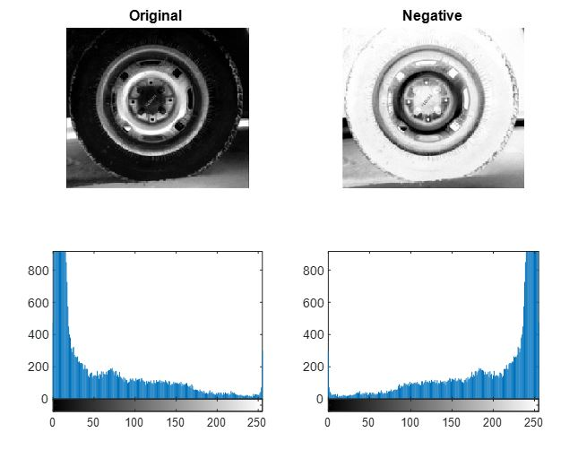

2. Gamma Transformation

  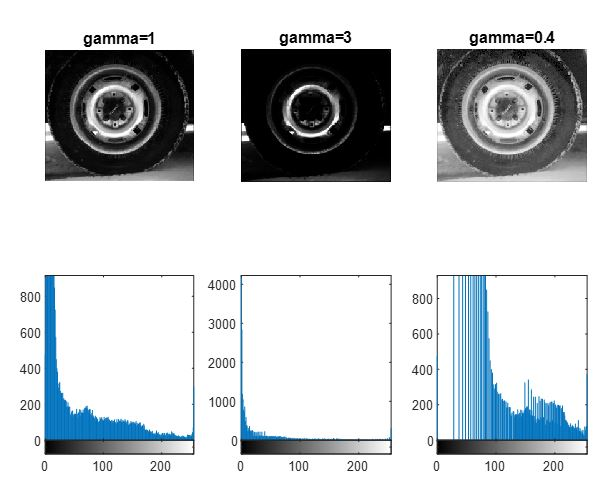

3. Log Transformation 1

  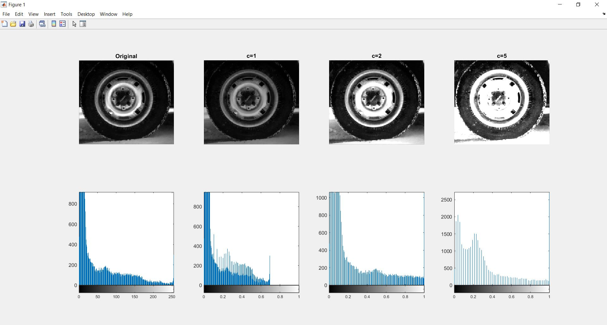

4. Log Transformation 2

  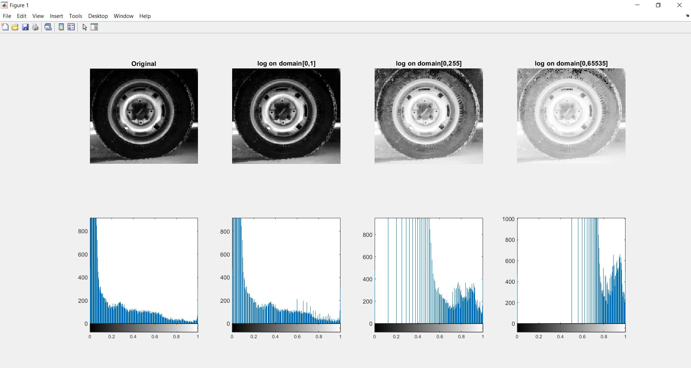

5. Contrast Stretching Transformation

  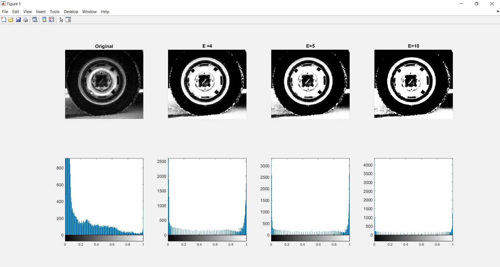

<h1><b>Week 3</b></h1>

1. Predefined Filter

  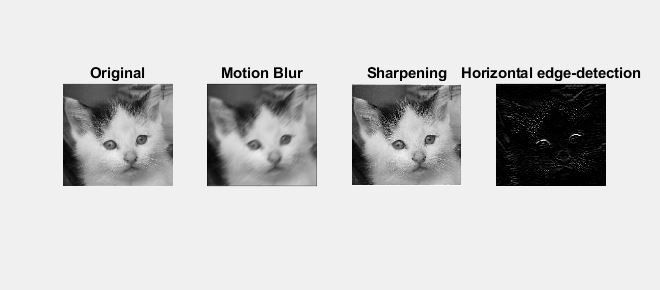

2. Filter 1

  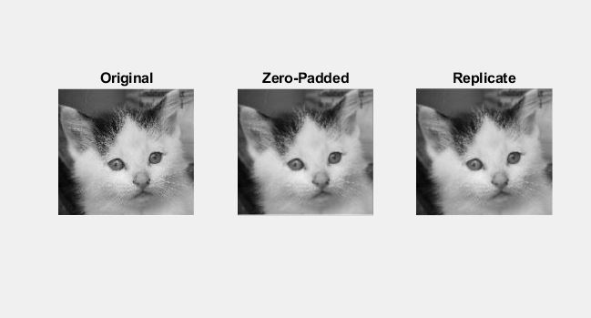

<h1><b>Week 4</b></h1>

1. Medium filtering VS Average filtering

  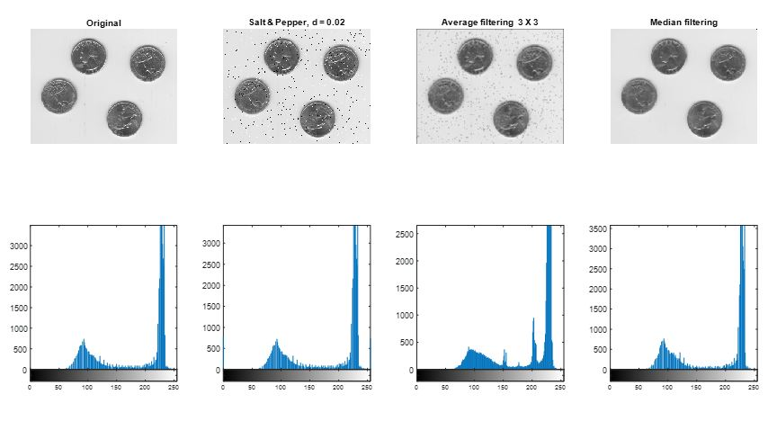

2. Noise Density VS Filter Size

  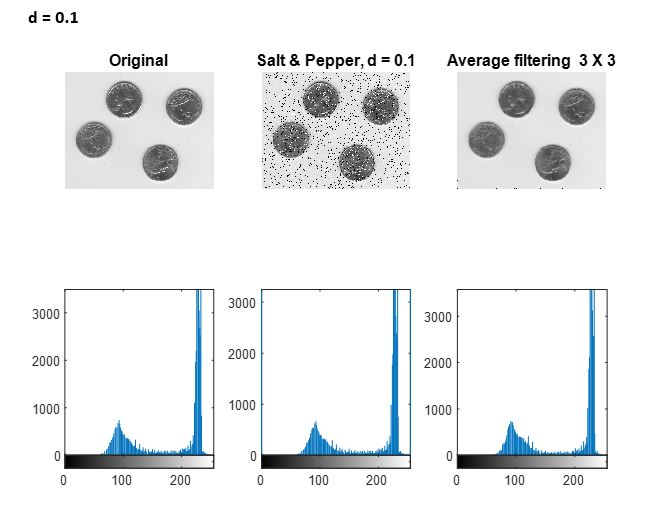

  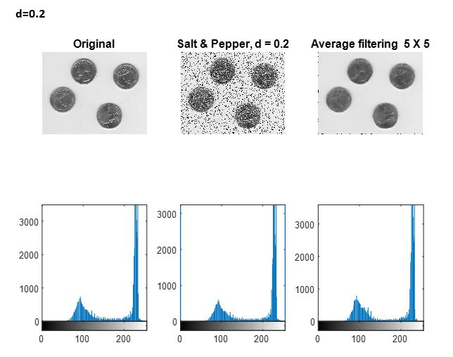

3. Graph of Noise Density VS Filter Size

  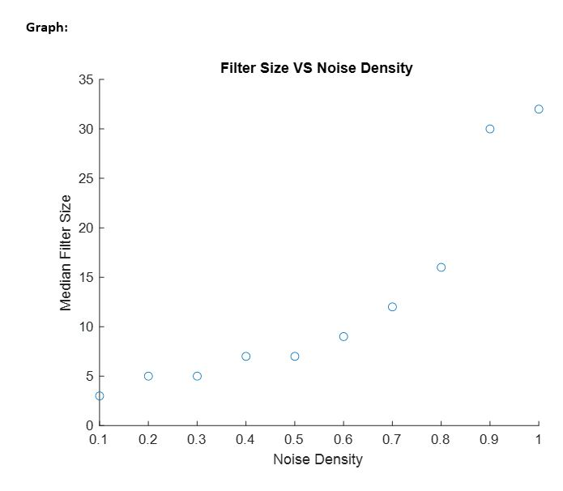

<h1><b>Week 5</b></h1>

1. Different kinds of edges detector

  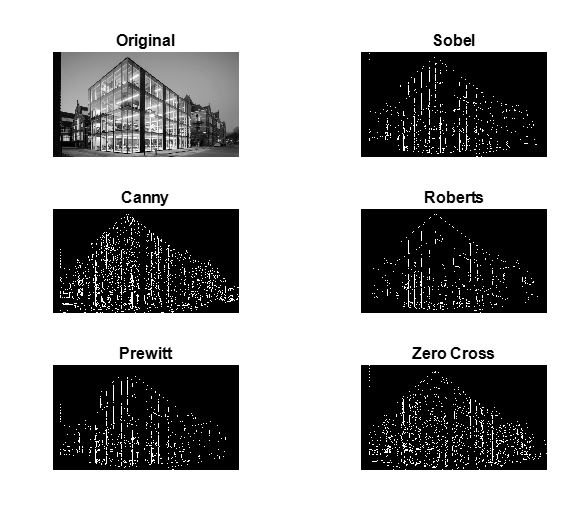

  

2. Segmentation of Object and Background

  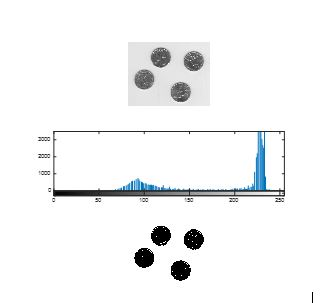

<h1><b>Week 6</b></h1>

1. Fundamental Morphological Operations

  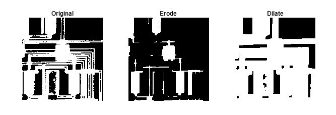

2. Compound Morphological Operations: Opening

  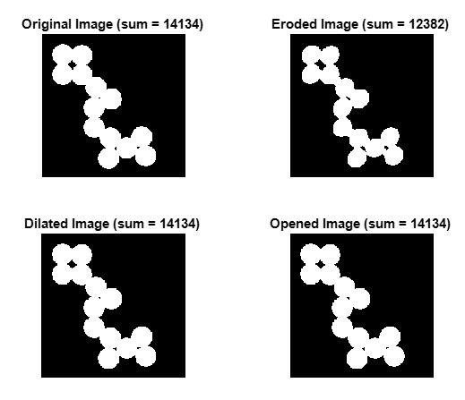

3.	Compound Morphological Operations: Closing

  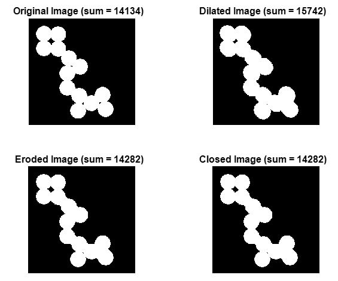

